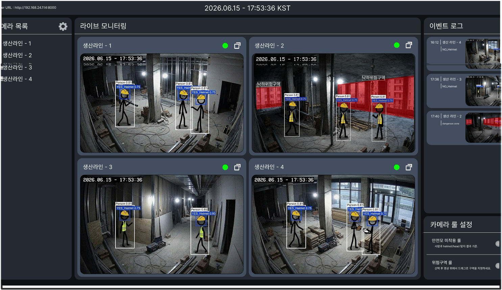
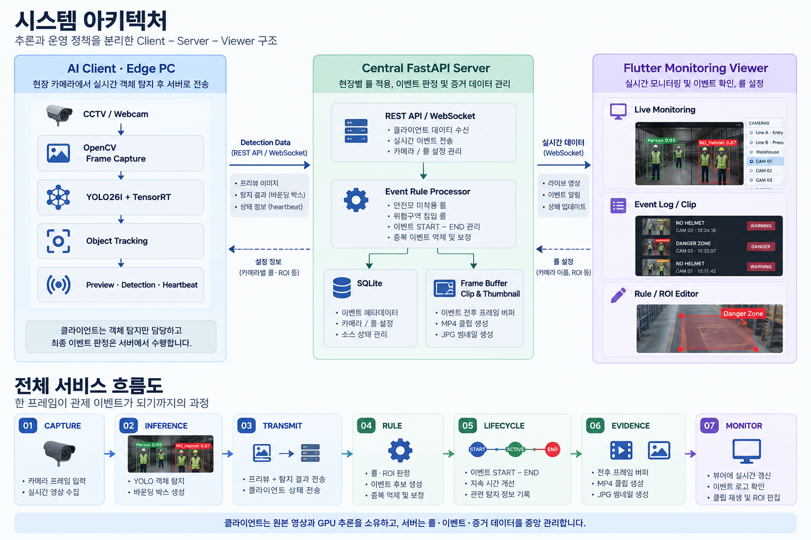
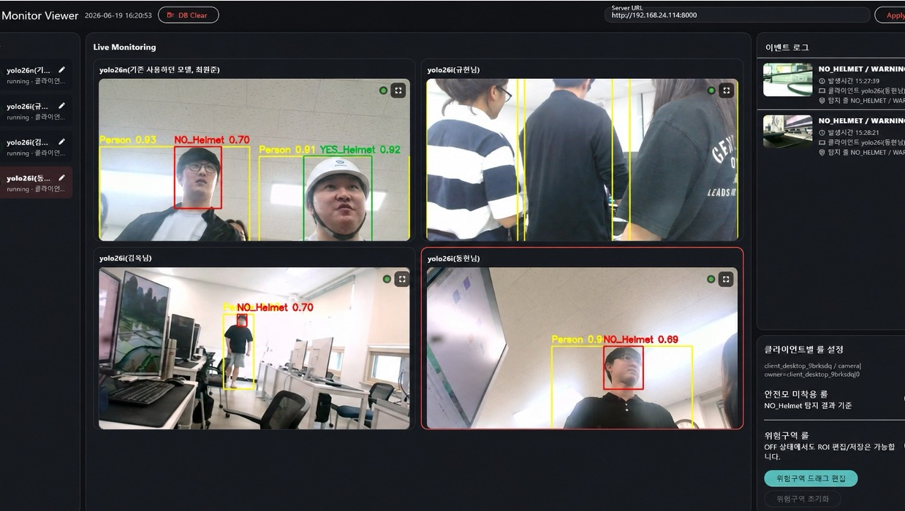

<div align="center">

# Industrial Safety AI Monitoring Service

### YOLO 기반 엣지 추론과 중앙 이벤트 판정을 결합한 실시간 산업 안전 모니터링 시스템




</div>

산업 현장의 CCTV·웹캠 영상에서 **작업자, 안전모 착용, 안전모 미착용**을 탐지하고, 안전모 미착용 및 위험구역 침입 이벤트를 관제 화면에 기록하는 팀 프로젝트입니다.

단순히 모델을 학습하는 데서 끝내지 않고, 카메라가 연결된 PC에서 추론한 결과를 중앙 서버로 전송하고 서버가 현장별 룰을 적용한 뒤 이벤트 로그·썸네일·영상 클립으로 남기는 전체 파이프라인을 구현했습니다.

---

## 기술 스택

| 영역 | 기술 |
| --- | --- |
| AI / Computer Vision | YOLO26, Ultralytics, PyTorch, ONNX, TensorRT 11, OpenCV |
| Backend | Python 3.12, FastAPI, Pydantic, Uvicorn |
| Realtime / Network | REST API, WebSocket, MJPEG Stream |
| Database / Storage | SQLite, JSON payload, MP4, JPG |
| Desktop UI | Flutter, Dart, media_kit |
| Target Environment | Windows 10/11, NVIDIA GPU, CUDA |

---

## 프로젝트 핵심 성과

- YOLO26n/s/l과 Batch Size, Optimizer 조합을 비교하여 **YOLO26l Batch32 AdamW**를 최종 모델로 선정
- 최종 모델에서 **mAP@50-95 0.4897, F1-score 0.7467, Recall 0.6650** 달성
- TensorRT 11 변환으로 추론 시간을 **29.275 ms → 7.118 ms**로 단축하여 PyTorch 대비 약 **4.11배 가속**
- 실제 시스템 적용 환경에서 모델 추론 **8.35 ms/frame, 약 119.8 FPS** 측정
- 서버에서 **안전모 미착용·위험구역 침입 룰**과 이벤트 START–END 수명주기 및 중복 억제 로직 구현
- Client–Server–Viewer를 분리하여 다중 카메라 확장과 중앙 룰 관리가 가능한 구조 설계
- 이벤트 발생 전후 프레임을 버퍼링하여 MP4 클립과 JPG 썸네일을 자동 생성

> FPS는 모델 추론 처리량이며, 전체 화면 FPS는 카메라 입력·네트워크·렌더링 환경에 따라 달라질 수 있습니다.

## 나의 중점 학습 및 수행 내용

이 프로젝트에서 저는 **실시간 CCTV 환경에 적합한 객체 탐지 모델 선정·배포 최적화**와 **서버 이벤트 탐지 룰 설계 및 구현**을 중점적으로 수행했습니다.

1. YOLO26n의 Batch Size와 Optimizer를 비교해 경량 모델의 성능 한계를 확인했습니다.
2. YOLO26n/s/l을 Parameters, GFLOPs, mAP, Recall, F1-score, 작은 객체 성능과 추론 속도로 비교했습니다.
3. 안전 시스템은 오탐보다 미탐의 영향이 크다는 점을 고려해, 단일 정확도보다 **Recall·F1-score·mAP<sub>S</sub>**를 핵심 선정 기준으로 삼았습니다.
4. YOLO26l 내부 실험에서 Batch32 AdamW가 가장 낮은 FN과 가장 높은 TP를 보여 최종 학습 조건으로 선정했습니다.
5. 학습 모델을 PyTorch → ONNX → TensorRT로 변환하고, 연구 환경과 실제 시스템 환경의 추론 속도를 각각 검증했습니다.
6. 서버에서 `NO_Helmet` 탐지를 안전모 미착용 이벤트로 판정하는 룰과, `Person` 박스가 사용자가 설정한 ROI와 겹치는지 판단하는 위험구역 침입 룰을 구현했습니다.
7. 단발성 탐지 결과가 이벤트 로그를 과도하게 생성하지 않도록 연속 프레임을 기준으로 이벤트의 START–END 수명주기를 관리하고, 중복 후보를 병합하도록 구성했습니다.
8. 일시적인 탐지 누락이나 tracker ID 변경이 발생해도 위치 유사도를 바탕으로 같은 이벤트를 이어서 처리하도록 보완했습니다.
9. 탐지 결과가 서버의 이벤트 판정, DB 저장, 클립 생성, Flutter 관제 화면까지 이어지는 전체 서비스 흐름을 분석했습니다.

### 서버 이벤트 탐지 룰

| 룰 | 판정 조건 | 처리 방식 |
| --- | --- | --- |
| 안전모 미착용 | `NO_Helmet` 객체 탐지 | 작업자별 이벤트 후보를 생성하고 동일 객체의 연속 탐지를 하나의 이벤트로 관리 |
| 위험구역 침입 | `Person` bounding box와 설정된 ROI가 교차 | 이벤트 발생 당시 ROI를 함께 저장해 이후 설정이 변경되어도 당시 영역을 재현 |

룰 활성화 여부와 위험구역 ROI는 카메라별 `rule_config`로 서버 DB에 저장됩니다. 이벤트 후보가 처음 확인되면 `START`, 일정 프레임 동안 더 이상 탐지되지 않으면 `END`로 전환하며, 종료 시 이벤트 지속 시간과 관련 detection을 함께 기록합니다. 또한 탐지 박스의 위치 유사도를 이용해 같은 프레임의 중복 이벤트와 tracker ID 변경에 따른 이벤트 분리를 줄였습니다.

상세한 실험 배경과 결과는 [YOLO26 CCTV 안전이벤트 탐지 프로젝트 연구보고서](YOLO26_CCTV_안전이벤트_탐지_프로젝트_연구보고서.docx)에서 확인할 수 있습니다.

보기 쉽게 정리한 자료는 [취업 포트폴리오 PPT](portfolio_ppt/Industrial_Safety_AI_Portfolio_이동현.pptx)에서 확인할 수 있습니다.

## 시스템 아키텍처

<p align="center">
  
</p>

### 역할 분리

| 구성 요소 | 역할 |
| --- | --- |
| AI Client | 로컬 카메라 접근, YOLO/TensorRT 추론, 객체 추적, 프리뷰·탐지 결과·heartbeat 전송 |
| Central Server | 소스 상태 관리, 룰 판정, 이벤트 수명주기 관리, SQLite 저장, 클립·썸네일 생성, WebSocket 갱신 |
| Monitoring Viewer | 다중 카메라 모니터링, 이벤트 조회·재생, 카메라 이름 및 룰 설정, 위험구역 ROI 편집 |

클라이언트는 객체 탐지만 담당하고 최종 이벤트는 서버가 판정합니다. 이 구조를 통해 모델 실행 환경과 운영 정책을 분리하고, 모든 클라이언트에 동일한 룰을 다시 배포하지 않아도 서버에서 카메라별 설정을 관리할 수 있습니다.

## 시스템 화면

### 최종 구현 뷰어 화면



## AI 모델 선정 과정

### 1. 모델 크기 비교

초기 비교에서는 YOLO26l이 연산량은 가장 크지만 mAP@50-95, F1-score, Recall, 작은 객체 탐지 성능에서 가장 우수했습니다. 기본 비교 조건에서 YOLO26l의 mAP<sub>S</sub>는 0.5790으로, YOLO26n의 0.2978보다 크게 향상되었습니다.

| 모델 | Parameters | GFLOPs | mAP@50-95 | mAP<sub>S</sub> | F1 | Recall | 시스템 추론 시간 |
| --- | ---: | ---: | ---: | ---: | ---: | ---: | ---: |
| YOLO26n | 2.50M | 5.77 | 0.3767 | 0.2978 | 0.6982 | 0.5741 | 10.6 ms |
| YOLO26s | 9.95M | 22.50 | 0.3873 | 0.3097 | 0.7129 | 0.5885 | 17.8 ms |
| **YOLO26l** | **26.18M** | **93.13** | **0.3933** | **0.5790** | **0.7200** | **0.5964** | **28.8 ms** |

### 2. YOLO26l 학습 조건 비교

| 학습 조건 | mAP@50 | mAP@50-95 | mAP<sub>S</sub> | F1 | Recall | TP | FN |
| --- | ---: | ---: | ---: | ---: | ---: | ---: | ---: |
| B16 AdamW | **0.7015** | 0.4891 | 0.3904 | 0.7410 | 0.6553 | 12,326 | 6,482 |
| **B32 AdamW** | 0.6984 | **0.4897** | 0.3988 | **0.7467** | **0.6650** | **12,508** | **6,300** |
| B32 MuSGD | 0.6870 | 0.4861 | **0.4083** | 0.7413 | 0.6567 | 12,351 | 6,457 |

Batch32 AdamW는 특정 단일 지표의 최고값이 아니라, Recall과 F1-score가 가장 높고 FN이 가장 낮았습니다. 위험 객체의 누락을 줄여야 하는 서비스 목적에 가장 적합하다고 판단했습니다.

### 3. 배포 최적화

| 배포 형식 | 추론 시간 | 처리량 | PyTorch 대비 |
| --- | ---: | ---: | ---: |
| PyTorch `.pt` | 29.275 ms | 34.16 FPS | 1.00× |
| ONNX `.onnx` | 14.670 ms | 68.17 FPS | 약 2.00× |
| **TensorRT 11 `.engine`** | **7.118 ms** | **140.37 FPS** | **약 4.11×** |
| 실제 시스템 적용 `.engine` | 8.35 ms | 약 119.8 FPS | - |

정확도가 높은 대형 모델을 선택하되 TensorRT FP16 최적화로 지연 시간을 보완하여, 작은 객체 탐지 성능과 실시간성을 함께 확보했습니다.

## 이벤트 처리 흐름

1. 클라이언트가 카메라 프레임을 읽고 `YES_Helmet`, `NO_Helmet`, `Person`을 탐지합니다.
2. IoU와 객체 크기 기반 동적 거리로 `Person`을 추적해 프레임 간 객체 ID를 유지합니다.
3. 프리뷰 이미지, detection box, source 상태를 중앙 서버로 전송합니다.
4. 서버가 카메라별 룰 설정을 조회합니다.
5. `NO_Helmet` 또는 `Person–ROI` 교차 여부로 이벤트 후보를 생성합니다.
6. 연속 프레임과 위치 유사도를 이용해 중복 이벤트를 병합하고 START–END 수명주기를 관리합니다.
7. 이벤트 종료 시 메모리 프레임 버퍼에서 발생 전 3초와 종료 후 1초 구간을 추출해 클립과 썸네일을 생성합니다.
8. 뷰어는 WebSocket 갱신 신호와 REST API를 통해 최신 상태, 이벤트 로그, 클립을 표시합니다.

## 주요 기능

- 실시간 YOLO 객체 탐지 및 TensorRT GPU 추론
- 다중 클라이언트의 카메라 소스 등록과 heartbeat 기반 연결 상태 관리
- 안전모 미착용 이벤트 탐지
- 사용자가 지정한 ROI 기반 위험구역 침입 탐지
- 짧은 탐지 누락과 tracker ID 변경을 고려한 이벤트 연속성 유지
- 이벤트 START–END 병합 및 지속 시간 기록
- 이벤트 전후 영상 클립과 썸네일 자동 저장
- 실시간 프리뷰 및 다중 카메라 그리드
- 이벤트별 카메라·시간 필터와 영상 재생
- 카메라 표시 이름, 룰 활성화 여부, ROI 중앙 관리


## 프로젝트 구조

```text
.
├─ README.md
├─ YOLO26_CCTV_..._연구보고서.docx
└─ safety_monitor_workspace/
   ├─ safety_monitor_client/
   │  ├─ lib/                         # Flutter 클라이언트 UI
   │  └─ embedded_backend/
   │     └─ app/analysis/             # 추론·추적·전송 파이프라인
   ├─ safety_monitor_server/
   │  ├─ main.py                      # 중앙 FastAPI 진입점
   │  └─ app/
   │     ├─ routers/                  # 소스·이벤트·클립·실시간 API
   │     ├─ server_event_processor.py # 중앙 이벤트 판정
   │     └─ server_clip_recorder.py   # 클립·썸네일 생성
   ├─ safety_monitor_viewer/
   │  └─ lib/                         # Flutter 관제 UI
   ├─ docs/                           # 설계 및 학습 문서
   ├─ DB_SCHEMA.md
   ├─ DEPENDENCIES.md
   └─ RUN_GUIDE.md
```

## 실행 방법

### 요구 환경

- Windows 10/11
- Python 3.12
- Flutter SDK 및 Visual Studio C++ Build Tools
- NVIDIA GPU와 호환 드라이버
- CUDA 지원 PyTorch 및 TensorRT
- Windows 개발자 모드

Flutter Windows 빌드의 경로 길이 문제를 방지하기 위해 저장소를 `C:\safety_monitor_workspace`처럼 짧은 경로에 두는 것을 권장합니다.

### 1. 환경 확인 및 의존성 설치

```bat
cd safety_monitor_workspace
check_environment.bat
install_dependencies.bat all
build_viewer.bat
build_client.bat
```

클라이언트 실행 전 아래 경로에 `best.pt` 또는 `best.engine`이 필요합니다.

```text
safety_monitor_client\embedded_backend\app\analysis\models\weights
```

### 2. 실행

```bat
run_server.bat
run_viewer.bat
run_client.bat
```

실행 순서는 **Server → Viewer → Client**입니다. 다른 PC에서 접속할 때는 `127.0.0.1` 대신 서버 PC의 IPv4 주소를 사용합니다.

```text
http://<SERVER_IP>:8000
```

서버 실행 후 `http://127.0.0.1:8000/docs`에서 Swagger UI로 API를 확인할 수 있습니다.

자세한 설치, 빌드, 네트워크 설정과 오류 대응은 [RUN_GUIDE.md](safety_monitor_workspace/RUN_GUIDE.md)를 참고하세요.

## 설계 문서

- [Workspace 상세 설명](safety_monitor_workspace/README.md)
- [실행 및 빌드 가이드](safety_monitor_workspace/RUN_GUIDE.md)
- [의존성 목록](safety_monitor_workspace/DEPENDENCIES.md)
- [SQLite DB 스키마](safety_monitor_workspace/DB_SCHEMA.md)
- [FastAPI 학습 정리](safety_monitor_workspace/docs/FASTAPI_PROJECT_SUMMARY.md)

## 한계와 개선 방향

- 야간, 역광, 우천·강설 등 환경 변화에 대한 데이터와 강건성 평가가 추가로 필요합니다.
- 원거리 안전모 탐지를 위해 고해상도 입력, tiling inference, P2 detection head를 비교할 계획입니다.
- TensorRT 엔진은 GPU 및 TensorRT 버전에 종속되므로 배포 PC별 엔진 빌드·호환성 검증이 필요합니다.
- 현재 SQLite와 인메모리 프레임 버퍼 구조는 프로토타입에 적합하며, 운영 규모가 커질 경우 메시지 큐, 외부 DB, 객체 스토리지 도입을 검토할 수 있습니다.
- pruning과 quantization을 적용해 저전력 임베디드 장치에서의 성능을 추가 검증할 계획입니다.

## 프로젝트 정보

- 프로젝트 유형: ㈜하이버스 연계 미래내일 일경험 팀 프로젝트
- 소속: 한국폴리텍대학 인공지능소프트웨어과
- 프로젝트 주제: 산업 안전 영상 이벤트 탐지 및 AI 모니터링 서비스
